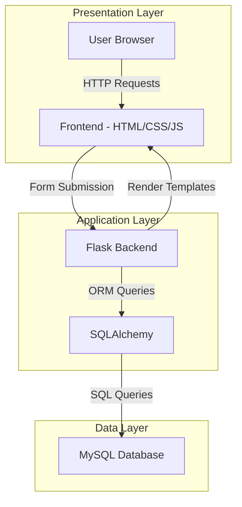

# Expense Tracker – Cloud-Based Three-Tier Application

Expense Tracker is a cloud-based web application designed to manage and analyze daily expenses. It follows a three-tier architecture, separating the presentation, application, and database layers for scalability, maintainability, and security.

The application is built using a Flask backend, MySQL database, and a web-based frontend, with deployment support on cloud infrastructure.

---

## Project Structure

    Expense-Tracker/
    |-- backend/
    |   |-- app.py
    |   |-- config.py
    |   |-- requirements.txt
    |-- templates/
    |   |-- index.html
    |   |-- edit.html
    |-- static/
    |   |-- css/
    |   |-- js/
    |-- README.md

---

## Architecture Overview

This project implements a three-tier architecture:

- Presentation Layer: HTML templates rendered using Flask  
- Application Layer: Flask backend handling business logic and routing  
- Data Layer: MySQL database hosted on cloud infrastructure  

---

## System Architecture

---

## Features

- Add, edit, and delete expenses  
- Categorize expenses for better tracking  
- Monthly and total expense calculation  
- Category-wise analytics  
- Responsive user interface  
- Cloud database connectivity  

---

## Database Configuration

The application connects to a MySQL database using SQLAlchemy. Database credentials are managed in `config.py`.

Example configuration:

    DATABASE_CONFIG = {
        'host': 'YOUR_DB_HOST',
        'user': 'YOUR_USERNAME',
        'password': 'YOUR_PASSWORD',
        'database': 'YOUR_DATABASE'
    }

---

## Backend Setup

1. Navigate to backend directory:

       cd backend

2. Install dependencies:

       pip install -r requirements.txt

3. Run the application:

       python app.py

The application will start on:

       http://localhost:5000

---

## Dependencies

- Flask  
- Flask-SQLAlchemy  
- PyMySQL  
- Gunicorn  

---

## Deployment

This application can be deployed on cloud platforms such as:

- Google Cloud Platform (Compute Engine / Cloud Run)  
- AWS EC2  
- Any Linux-based virtual machine  

### Recommended Production Setup

- Use Gunicorn as the WSGI server  
- Configure Nginx as a reverse proxy  
- Secure database access using firewall rules  
- Store credentials using environment variables instead of hardcoding  

---

## Key Implementation Details

- SQLAlchemy ORM is used for database interaction  
- Expense model includes fields such as date, description, amount, category, and notes  
- Data aggregation is performed for analytics (total spend, monthly spend, category breakdown)  
- Server runs on `0.0.0.0` to allow external access in cloud environments  

---

## Local Development

To run the project locally:

1. Configure database credentials in `config.py`  
2. Ensure MySQL server is running  
3. Install dependencies  
4. Run the Flask application  
5. Access via browser  

---

## Future Enhancements

- User authentication and role-based access  
- API-based architecture for frontend-backend separation  
- Docker containerization  
- CI/CD pipeline integration  
- Advanced analytics dashboard  

---

## Authors

- Harshit Verma  
- Gurnoor Kaur Pawan – https://github.com/Gurnoor2910
